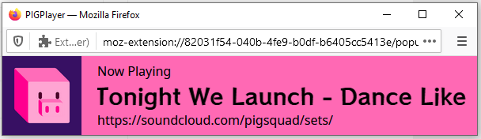

# PIGPlayer
a browser extension for streaming PIGSquad music

## What is this?
PIGSquad curates playlists of community-submitted music that's safe for streaming. That's right: local, artisanal, worry-free beats to game to.

PIGPlayer is a browser extension that gives you a handy little "Now Playing" window for your stream.

 

## How to Use

### Firefox + OBS
 

1. Install the add-on:
    a. [Download it here](https://github.com/nextlevelbanana/PIGPlayer/raw/main/pigplayer-1.0.1-fx.xpi), choose Save File.
    b. Click on the downloaded file, choose to open it with Firefox. Firefox will ask `Add PIGPlayer`? Click Add.
2. Go to [https://soundcloud.com/pigsquad/sets/](https://soundcloud.com/pigsquad/sets/) and pick a playlist.
3. Click the extension's icon in the upper right of the browser toolbar. (It looks like assets/song.svg.)
4. Click the button that says `Launch PigPlayer!`. (This will attempt to open a popup; you might have to click "allow popup" in the browser somewhere.)
5. Go into OBS, add a Window Capture to your scene.
6. Pick the window titled PIGPlayer, set Window Match Priority to `Window Title Must Match`.
7. To crop out the address bar, hold down ALT while dragging the top anchor.
8. Back in soundcloud, hit play. You're good to go!

### Other Browsers
Not implemented yet. Pull requests welcome ;)

